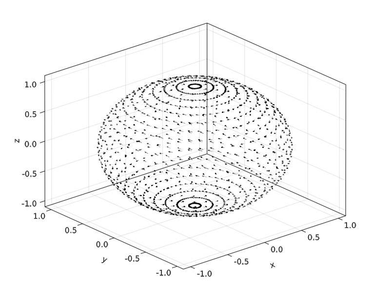

# Examples

We take a look at the simple example from

In the following code an ODE on a sphere is solved the introductory example from the
[lecture notes](https://www.unige.ch/~hairer/poly-sde-mani.pdf) by [E. Hairer](http://www.unige.ch/~hairer/).

We solve the ODE system on the sphere ``\mathbb S^2`` given by

```math
\begin{pmatrix}
    \dot x \\
    \dot y \\
    \dot z
\end{pmatrix}
=
\begin{pmatrix}
    0 & z/I_3 & -y/I_2 \\
    -z/I_3 & 0 & x/I_1 \\
    y/I_2& -x/I_1 & 0
\end{pmatrix}
\begin{pmatrix}
    x \\
    y \\
    z
\end{pmatrix}
```

```julia
using ManifoldDiffEq, Manifolds
using GLMakie, LinearAlgebra, Colors

n = 25

θ = [0;(0.5:n-0.5)/n;1]
φ = [(0:2n-2)*2/(2n-1);2]
x = [cospi(φ)*sinpi(θ) for θ in θ, φ in φ]
y = [sinpi(φ)*sinpi(θ) for θ in θ, φ in φ]
z = [cospi(θ) for θ in θ, φ in φ]

function f2(x, y, z)
    Iv = [1.6, 1.0, 2/3]
    p = [x, y, z]
    A = [0 -z y; z 0 -x; -y x 0]
    return A * (p./Iv)
end

tans = f2.(vec(x), vec(y), vec(z))
u = [a[1] for a in tans]
v = [a[2] for a in tans]
w = [a[3] for a in tans]

f = Figure();
Axis3(f[1,1])

arr = GLMakie.arrows!(
           vec(x), vec(y), vec(z), u, v, w;
           arrowsize = 0.02, linecolor = (:gray, 0.7), linewidth = 0.0075, lengthscale = 0.1
)
save("docs/src/assets/img/first_example_vector_field.png", f)
```
which looks like



Let's set up the manifold, the [sphere](https://juliamanifolds.github.io/Manifolds.jl/stable/manifolds/sphere.html) and two different types of problems/solvers
A first one that uses the Lie group action of the [Special orthogonal group](https://juliamanifolds.github.io/Manifolds.jl/stable/manifolds/group.html#Special-orthogonal-group)
acting on data with 2 solvers and direct solvers on the sphere, using 3 other solvers using the idea of frozen coefficients.

```julia
S2 = Manifolds.Sphere(2)
u0 = [0.0, sqrt(9/10), sqrt(1/10)]
tspan = (0, 20.0)

A_lie = LieManifoldDiffEqOperator{Float64}() do u, p, t
    return hat(SpecialOrthogonal(3), Matrix(I(3)), cross(u, f2(u...)))
end
prob_lie = ManifoldODEProblem(A_lie, u0, tspan, S2)

A_frozen = FrozenManifoldDiffEqOperator{Float64}() do u, p, t
    return f2(u...)
end
prob_frozen = ManifoldODEProblem(A_frozen, u0, tspan, S2)

action = RotationAction(Euclidean(3), SpecialOrthogonal(3))
alg_lie_euler = ManifoldDiffEq.ManifoldLieEuler(S2, ExponentialRetraction(), action)
alg_lie_rkmk4 = ManifoldDiffEq.RKMK4(S2, ExponentialRetraction(), action)

alg_manifold_euler = ManifoldDiffEq.ManifoldEuler(S2, ExponentialRetraction())
alg_cg2 = ManifoldDiffEq.CG2(S2, ExponentialRetraction())
alg_cg23 = ManifoldDiffEq.CG2_3(S2, ExponentialRetraction())
alg_cg3 = ManifoldDiffEq.CG3(S2, ExponentialRetraction())

dt = 0.1
sol_lie = solve(prob_lie, alg_lie_euler, dt = dt)
sol_rkmk4 = solve(prob_lie, alg_lie_rkmk4, dt = dt)

sol_frozen = solve(prob_frozen, alg_manifold_euler, dt=dt)
sol_frozen_cg2 = solve(prob_frozen, alg_cg2, dt = dt)
sol_frozen_cg23 = solve(prob_frozen, alg_cg23)
sol_frozen_cg3 = solve(prob_frozen, alg_cg3, dt = dt)

plot_sol(sol, col) = GLMakie.lines!([u[1] for u in sol.u], [u[2] for u in sol.u], [u[3] for u in sol.u]; linewidth = 2, color=col)

l1 = plot_sol(sol_lie, colorant"#999933")
l2 = plot_sol(sol_rkmk4, colorant"#DDCC77")
l3 = plot_sol(sol_frozen, colorant"#332288")
l4 = plot_sol(sol_frozen_cg2, colorant"#CCEE88")
l5 = plot_sol(sol_frozen_cg23, colorant"#88CCEE")
l6 = plot_sol(sol_frozen_cg3, colorant"#44AA99")
Legend(f[1, 2],
    [l1, l2, l3, l4, l5, l6],
    ["Lie Euler", "RKMK4", "Euler", "CG2", "CG2(3)", "CG3"]
)
save("docs/src/assets/img/first_example_solutions.png", f)
```

And the solutions look like


Note that `alg_cg23` uses adaptive time stepping.
